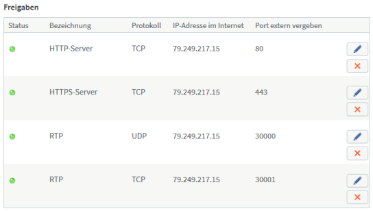

# Jitsi Meet on K3os

Scripts and tools to accomplish automated installations of [Jitsi Meet][1] with [k3os][2]
(Rancher Labs' tiny Kubernetes distribution [k3s][3] on a bespoke operating system), 
all inside the KVM based open-source virtualization platform [Proxmox VE 6.1][4].


## 1st Part: install K3os on a Proxmox VM

We want to create a virtual machine (VM) using the KVM hypervisor of Proxmox, without using any manual steps.


In oder to accomplish this, we need a customized version of the K3os ISO image, 
that does not ask any questions during installation.
For each new version of K3os, this remastered ISO image needs to be created only once.

With [`cloud-init`][5] technology, it is possible to inject unique configuration data (aka `config.yaml`) 
into the fully automatic installation process of a K3os VM.
So for each K3os instance, that we want to create, a separate `cloud-init` CDROM (ISO image) needs to be built.

Refer to Rancher Labs' [Github repo][2] for documentation on installing and running K3os.


### Preparations

- remaster the K3OS ISO image: adapt `/boot/grub/grub.cfg` for fully automatic installation
```
( cd 1-remaster ; sudo k3os-remaster.sh /path/to/k3os-0100-amd64.iso )
```
- copy the remastered ISO `new-k3os-0100-amd64.iso` to the image store of the Proxmox VE server
- create a customized `cloud-init` CDROM, using https://github.com/pagong/cloudinit-for-k3os
- please adapt the `user-data` file (aka `config.yaml`) for your environment:
  - at least `hostname`, `password` for user `rancher` and the `ssh` keys should be changed
```
( cd 2-cloudinit ; k3os-build.sh jitsi3 )
```
- copy the customized `cidata-jitsi3.iso` ISO to the image store of the Proxmox VE server


### Create a Proxmox VM for K3os

- create a new VM with at least 2 vCPU, 3 GB of memory and a 20 GB SCSI disk (`/dev/sda`)
- a virtual network card with access to a DHCP server and the internet is also recommended
- add 2 CDROM drives: 1st is for `new-k3os-0100-amd64.iso`, 2nd is for `cidata-jitsi3.iso`
- remember to enable the option `QEMU Guest Agent`
- power on the VM and watch the fully automatic installation


### Explore the K3os operating system

- after the reboot, you can login to the VM as user `rancher` with the preconfigured credentials
- have a look around:
```
lsblk ; blkid
ip a; ip r
df -h; date
```
- wait a few minutes, then explore the Kubernetes cluster
```
kubectl get nodes -o wide
kubectl get all -A
```
- use `sudo -i` to become user `root` and explore the unique features of K3os :smile:


## 2nd Part: install containerized Jitsi Meet on K3os


German computer magazine c't featured the [`team-container`][6] project in it's issue [9/2020][7] and [12/2020][8]. 
This project implements containerized team apps, like Nextcloud, Rocket.Chat and Jitsi Meet, on a Kubernetes platform.
c't are using Ubuntu and [k3s][3] as container infrastructure. 

However, I would like to use [k3os][2] instead.
In order to have a separate workspace, I've cloned the relevant part of the c't repository to directory `3-jitsi-meet`.
And we are going to explore the c't code in there.


### First impressions

Analysis of `3-jitsi-meet/install.sh`:

Installation of `k3s` is not needed, as `k3os` comes already bundled with `k3s`.
And some parts of the `install.sh` script of the c't project can be integrated into the `user-data` file for `jitsi3`.

The downloaded installation script of `helm3` does not work on `k3os`. 
Some small modifications to the installer script are needed:
```
diff helm3-installer.sh-orig helm3-installer.sh-new
--- helm3-installer.sh-orig
+++ helm3-installer.sh-new
@@ -131,7 +131,7 @@
 # installs it.
 installFile() {
   HELM_TMP="$HELM_TMP_ROOT/$BINARY_NAME"
-  local sum=$(openssl sha1 -sha256 ${HELM_TMP_FILE} | awk '{print $2}')
+  local sum=$(sha256sum ${HELM_TMP_FILE} | awk '{print $1}')
   local expected_sum=$(cat ${HELM_SUM_FILE})
   if [ "$sum" != "$expected_sum" ]; then
     echo "SHA sum of ${HELM_TMP_FILE} does not match. Aborting."
```

With this modification to the installer script, `helm3` can be installed on `k3os`.
```
jitsi3 [~]$ which helm
/usr/local/bin/helm

jitsi3 [~]$ helm version
version.BuildInfo{Version:"v3.1.2", GitCommit:"d878d4d45863e42fd5cff6743294a11d28a9abce", GitTreeState:"clean", GoVersion:"go1.13.8"}

jitsi3 [~]$ kubectl get nodes -o wide
NAME     STATUS   ROLES    AGE     VERSION        INTERNAL-IP     EXTERNAL-IP   OS-IMAGE       KERNEL-VERSION     CONTAINER-RUNTIME
jitsi3   Ready    master   6d22h   v1.17.4+k3s1   192.168.1.202   <none>        k3OS v0.10.0   5.0.0-43-generic   containerd://1.3.3-k3s2
```


### Set up Traefik2 as ingress router

My internet router, a so called `FRITZ!Box` (made by AVM), is working as a NAT gateway.
Thus the following ports need to be forwarded from the `FRITZ!Box` to the `k3os` VM.



Every `FRITZ!Box` owner can apply for a `MyFRITZ!` address, that can be used to access the router from the internet. 
It's kind of a dynamic DNS service, that can also be used in port forwardings to reach services on the internal LAN.
`MyFRITZ!` addresses look like `https://0123456789abcdef.myfritz.net/`, where the string `0123456789abcdef` 
is a place holder for a string of 16 characters, that is unique for each `FRITZ!Box`.

My goal is to reach the internal `k3os` VM by using the address `jitsi3.0123456789abcdef.myfritz.net`.
As we don't have control over the DNS domain `0123456789abcdef.myfritz.net`, it is not possible 
to get a Let's Encrypt certificate for a wildcard domain.

So, here comes [`Traefik2`][9] to our rescue. 
By using `Middlewares` like `stripprefix`, it is possible to change the c't code from fqdn-based routing to path-based routing.

Add this `Middleware` to file `3-jitsi-meet/team-setup/templates/ingress/06-middleware.yaml`:

Change a few lines in  file `3-jitsi-meet/team-setup/templates/landingpage/ingress.yaml`:

And configure the file `3-jitsi-meet/values-setup.yaml`:
```
acme:
  mail: erika.mustermann@t-online.de
  production: true
app:
  name: jitsi3
  domain: 0123456789abcdef.myfritz.net
```

Finally, you can start the `Traefik2` router by issuing the command
```
( cd 3-jitsi-meet ; helm install --debug setup team-setup --values values-setup.yaml )
```


### Install Jitsi-Meet via helm chart

Hint: use command `openssl rand -base64 15` to generate random strings for secrets and endpoints.


[1]: https://github.com/jitsi/docker-jitsi-meet
[2]: https://github.com/rancher/k3os
[3]: https://github.com/rancher/k3s
[4]: https://www.proxmox.com/en/proxmox-ve
[5]: https://cloudinit.readthedocs.io/en/latest/
[6]: https://github.com/ct-Open-Source/team-container
[7]: https://www.heise.de/select/ct/2020/9/2007712573850503640
[8]: https://www.heise.de/select/ct/2020/12/2011112595746278280
[8]: https://docs.traefik.io/migration/v1-to-v2/#strip-and-rewrite-path-prefixes
